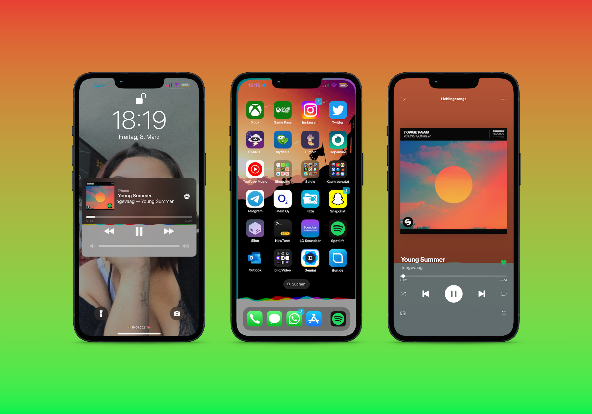

# Mitsuha Forever

This is a fork of a Nepeta's and ryannair05 tweak - [MitsuhaForever](https://github.com/ryannair05/MitsuhaForever) with support for iOS 15-16 Rootless, spotify wavehigh fixed and more to come.

## Screenshots

## Installation

1. Add this repository to your package manager: https://zsaaiq.github.io/jailbreakrepo/
2. Install **Mitsuha Forever**.

### Supported apps
* Spotify
* SpringBoard, Lockscreen, CC Music Player

## Donations

Support the original developer, c0ldra1n, not me, here: https://www.paypal.me/c0ldra1n

## Credits

* [c0ldra1n](https://github.com/c0ldra1n/) - Developed the original tweak for iOS 10 and earlier.
* Nepeta - Developed the original Mitsuha Infinity.
* [cbyrne](https://github.com/conorthedev) - Originally developed this tweak.
